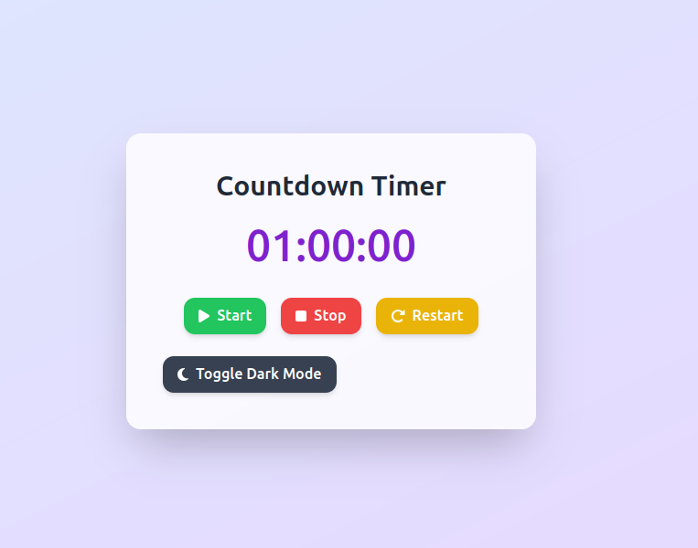

# ⏳ Countdown Timer



A beautiful **Countdown Timer** built with **HTML5 + Tailwind CSS + Font Awesome**, featuring:

✅ Modern responsive design  
✅ Start, Stop, Restart buttons with icons  
✅ Toggleable Dark Mode  
✅ Easy to integrate with your own JavaScript logic

---

## ✨ Features

- 🌗 **Dark Mode toggle** with smooth transitions  
- 🎨 **Tailwind CSS design** with gradient background and glassmorphism card  
- ⏱ **Start / Stop / Restart** buttons with Font Awesome icons  
- 📱 Fully **responsive** for mobile and desktop  
- ⚡ Ready to integrate your countdown JavaScript logic

---

## 📂 File Structure

/countdown
┣ index.html
┣ main.js
┗ README.md


- `index.html` – Frontend structure with Tailwind and Font Awesome  
- `main.js` – Your countdown timer logic  
- `README.md` – Project documentation

---

## 🔧 Usage

1. Clone this repository:
    ```bash
    git clone https://github.com/sardorbekjumayev/countdown.git
    cd countdown
    ```

2. Open `index.html` in your browser to see the design.

3. Customize `main.js` to implement your timer logic.

---

## 🛠 Dependencies

- [Tailwind CSS CDN](https://cdn.tailwindcss.com)
- [Font Awesome](https://cdnjs.com/libraries/font-awesome)

---

## 💡 Screenshot


---

## 🌙 Dark Mode

Toggle dark mode using the button at the bottom of the card.

---

## 🤝 Contributing

Pull requests are welcome. For major changes, please open an issue first to discuss what you would like to change.

---

## 📄 License

This project is open source under the [MIT License](LICENSE).

---

### ⭐ Show your support

If you like this project, please **star ⭐ the repository** and follow for more frontend templates.

---

> Designed with ❤️ by [Your Name](https://github.com/sardorbekjumayev)

